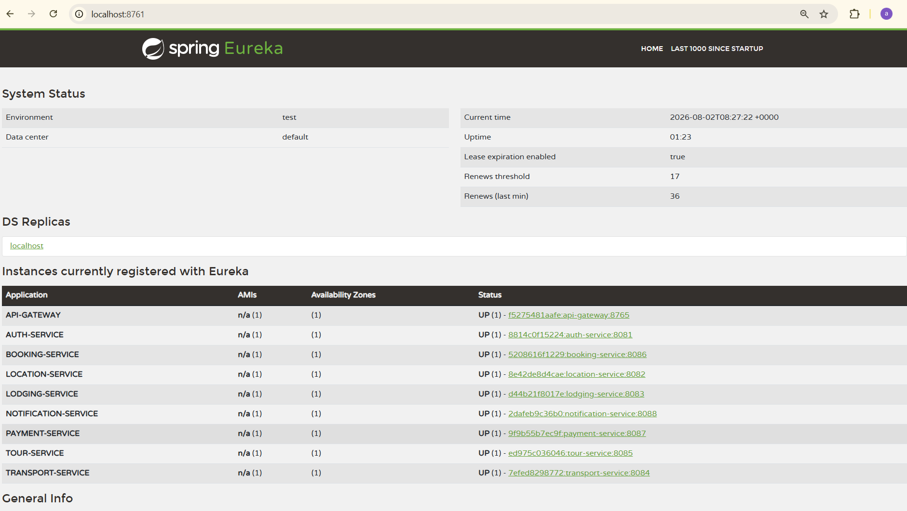
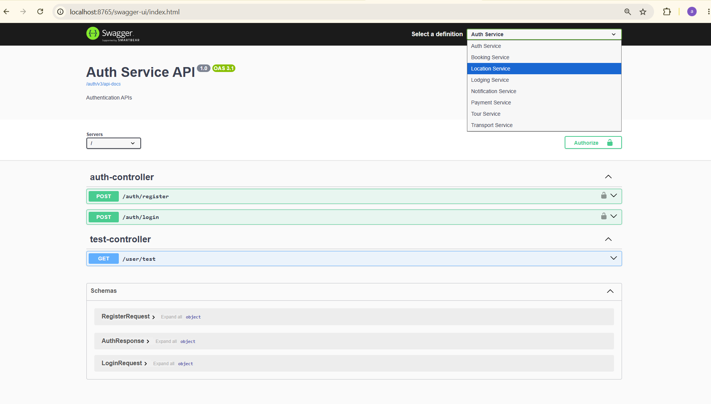
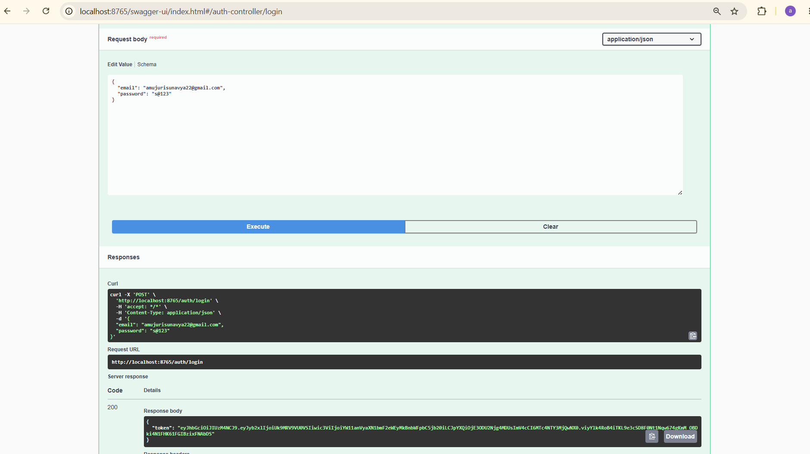
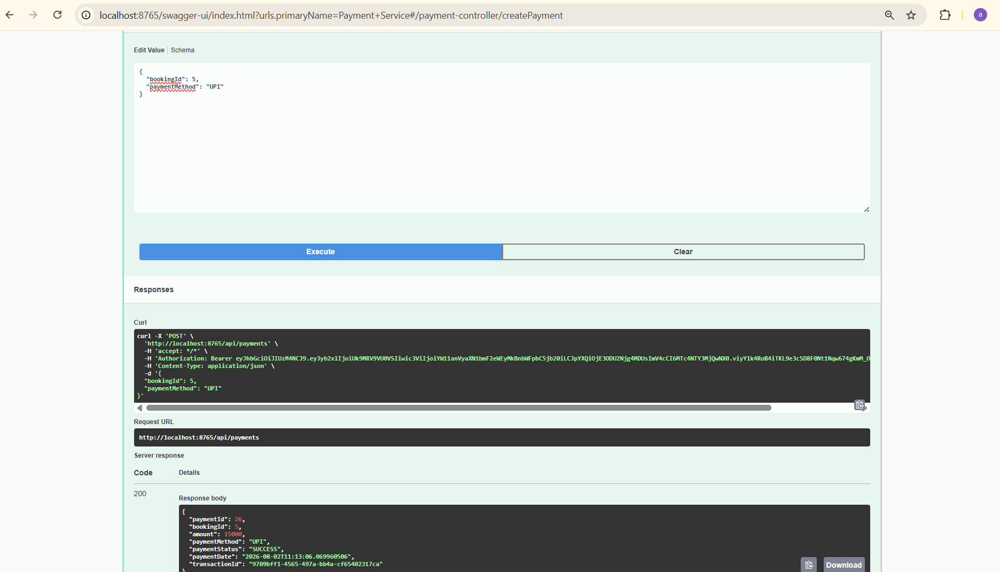
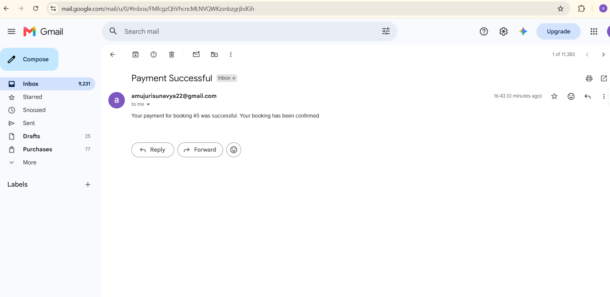

# Tour Management System

A production-style **Spring Boot Microservices** application for managing tours, bookings, payments, and notifications.

The application follows a modern microservices architecture using **Spring Cloud**, **API Gateway**, **Eureka Service Discovery**, **JWT Authentication**, **OpenFeign**, **Docker**, and **PostgreSQL**.

---

##  Project Overview

The Tour Management System allows users to:

- Browse available tours
- Book tour packages
- Make secure payments
- Receive email notifications
- Authenticate using JWT
- Access all services through an API Gateway

The project demonstrates real-world microservices communication and deployment using Docker.

---

##  Features

-  JWT Authentication & Authorization
-  Tour Management
-  Location Management
-  Lodging Management
-  Transport Management
-  Booking Management
-  Payment Processing
-  Email Notifications
-  API Gateway
-  Eureka Service Discovery
-  Swagger API Documentation
-  OpenFeign Inter-Service Communication
-  Dockerized Microservices
-  Global Exception Handling
-  Resilience4j Circuit Breaker


##  Microservices Architecture

##  Microservices Architecture

The application is built using a distributed microservices architecture.

### Services

| Service | Description |
|---------|-------------|
|  Auth Service | User Registration, Login, JWT Authentication |
|  Tour Service | Manages Tour Packages |
|  Location Service | Manages Tour Locations |
|  Lodging Service | Manages Hotel/Lodging Details |
|  Transport Service | Manages Transportation Details |
|  Booking Service | Creates and Manages Bookings |
|  Payment Service | Handles Payments and Confirms Bookings |
|  Notification Service | Sends Email Notifications |
|  API Gateway | Routes Requests to Microservices |
|  Eureka Server | Service Discovery |

---

### Architecture Flow

                    +----------------------+
                    |      Client          |
                    +----------+-----------+
                               |
                               |
                        API Gateway
                               |
        -------------------------------------------------
        |        |        |        |         |          |
      Auth     Tour    Booking  Payment  Notification  Others
                    |
          -------------------------
          |          |           |
     Location    Lodging    Transport

                Eureka Server
          (Service Discovery)


## Technology Stack

## 🛠️ Technology Stack

### Backend

- Java 17
- Spring Boot
- Spring Security
- Spring Cloud
- Spring Data JPA
- Spring Validation

### Microservices

- Spring Cloud Gateway
- Eureka Server
- OpenFeign
- Resilience4j

### Database

- PostgreSQL

### Security

- JWT Authentication
- BCrypt Password Encoder

### Documentation

- Swagger / OpenAPI

### Build Tool

- Maven

### Containerization

- Docker
- Docker Compose

### Version Control

- Git
- GitHub

### How to Run the Project

### Clone the Repository

```bash
git clone https://github.com/Sunavya-Amujuri/TourManagementApp.git
```

### Navigate to the Project

```bash
cd TourManagementApp/docker
```

### Build the Services

```bash
docker compose build
```

### Start All Services

```bash
docker compose up -d
```

### Verify Running Containers

```bash
docker ps
```

All microservices, PostgreSQL, and Redis should be running successfully.

---

## API Documentation

Swagger UI is available through the API Gateway.

```
http://localhost:8765/swagger-ui.html
```

Available APIs include:

- Auth Service
- Tour Service
- Location Service
- Lodging Service
- Transport Service
- Booking Service
- Payment Service
- Notification Service

---

## 🔐 Authentication & Authorization

The application is secured using **Spring Security** and **JWT (JSON Web Token)**.

### Authentication Flow

1. User registers using the Auth Service.
2. User logs in with valid credentials.
3. Auth Service generates a JWT token.
4. The client includes the JWT token in the Authorization header.
5. API Gateway validates the token before forwarding requests to the respective microservice.

Example Header:

```http
Authorization: Bearer <your-jwt-token>
```

---

## 🔄 Application Workflow

### Booking Flow

```text
User
   │
   ▼
Auth Service (Login)
   │
   ▼
API Gateway
   │
   ▼
Tour Service
   │
   ▼
Booking Service
   │
   ▼
Payment Service
   │
   ▼
Booking Confirmation
   │
   ▼
Notification Service
   │
   ▼
Email Sent Successfully
```

### Inter-Service Communication

- Booking Service → Tour Service (Validate Tour & Reserve Seats)
- Payment Service → Booking Service (Confirm Booking)
- Payment Service → Notification Service (Send Email)

---

##  Screenshots

## Application Screenshots

### Eureka Service Registry



---

### API Gateway Swagger UI



---

### JWT Authentication



---

### Payment Processing



---

### Email Notification



